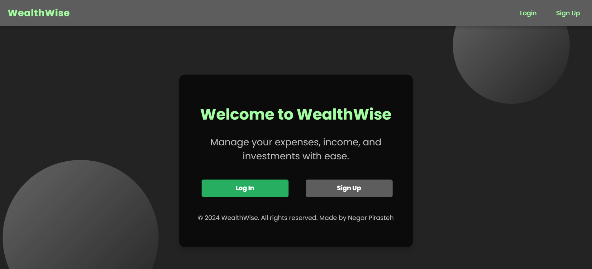
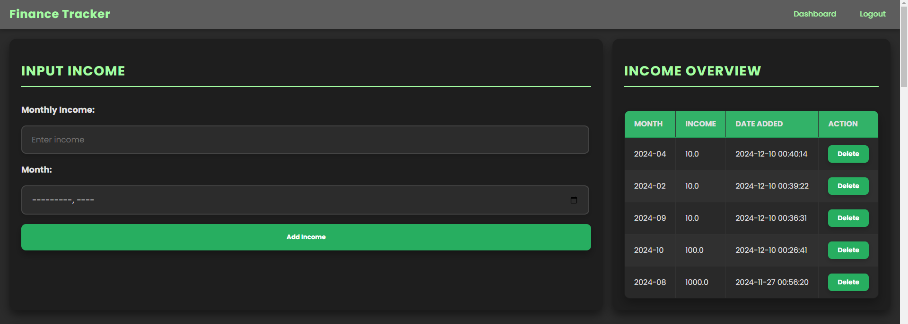
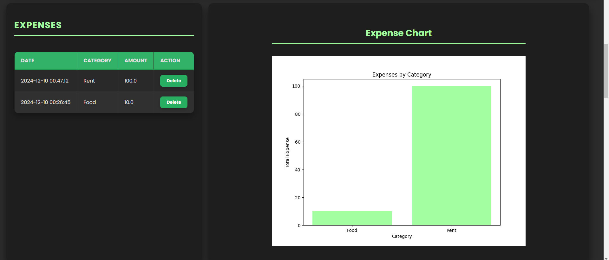
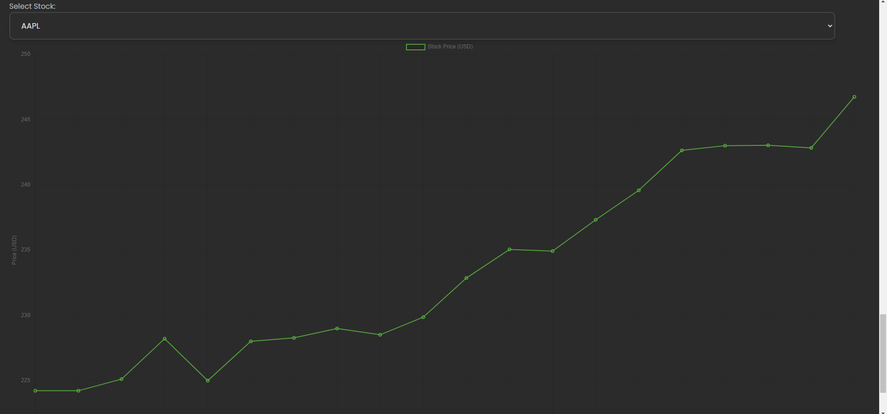
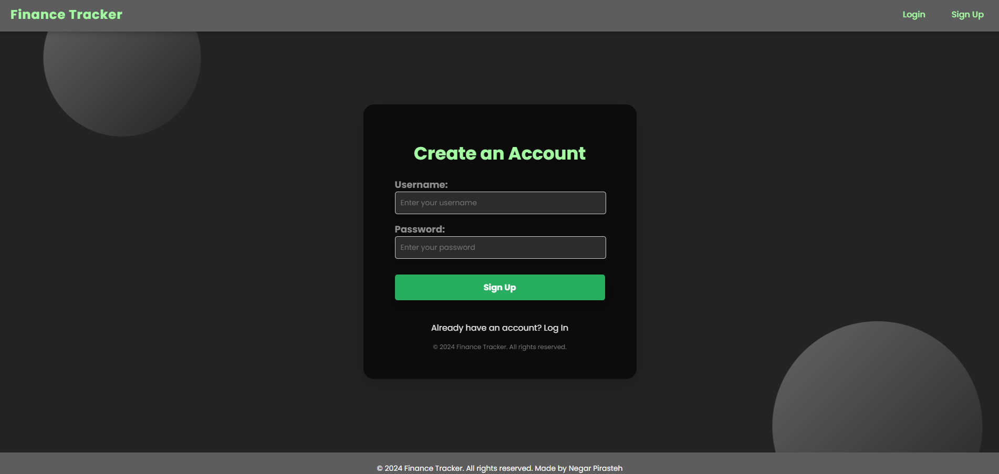
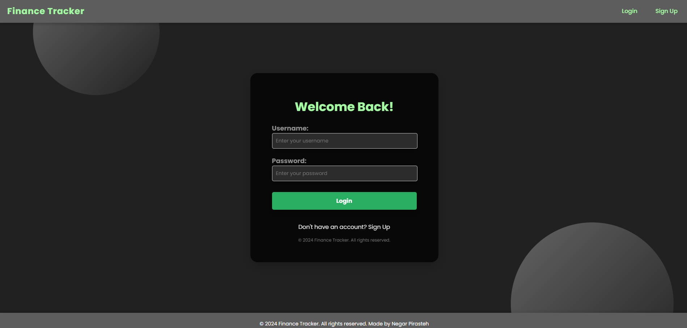

# 📊 Financial Tracker

  
*Your ultimate tool for personal finance management.*

## 🌟 Project Overview
**Financial Tracker** is a comprehensive personal finance dashboard that helps users track their income, expenses, and investments with real-time insights. Designed to simplify financial management, it offers visual charts, intuitive inputs, and seamless user interaction. Perfect for anyone who wants to take control of their finances, this project combines functionality with a sleek, modern design.

---

## 🛠️ Features

### ✅ **Core Functionalities**
- **Income Tracking**:  
  Input monthly income and review a historical log.
  
- **Expense Management**:  
  Add expenses by category and visualize spending trends.

- **Investment Portfolio**:  
  Log stock investments and track allocation in a dynamic pie chart.

- **Live Stock Price Tracking**:  
  Fetch and display real-time stock prices using the Yahoo Finance API with a fully interactive chart.

---

### 📊 **Visual Dashboards**
- Income and Expense tables with easy data input.
- Dynamic charts (line, pie) for quick visual analysis.
- Live stock price chart with stock-specific filtering.

### 🔒 **Security**
- User authentication (login/logout) with session timeout for enhanced security.

### ⚡ **Performance**
- Responsive design for smooth user experience across devices.
- Optimized backend using Flask and SQLite.

### 🌐 **Deployment**
- Hosted live on [Render](https://render.com), ensuring reliability and accessibility.

---

## 🚀 Technologies Used

### **Frontend**:
- **HTML5 & CSS3**: Clean and responsive UI.
- **JavaScript**: Interactive charts with Chart.js.

### **Backend**:
- **Flask**: Python framework for routing and logic.
- **SQLite**: Lightweight database for data storage.

### **APIs**:
- **Yahoo Finance API**: Fetch real-time stock prices.

### **Deployment**:
- **Render**: Hosting the live application with professional-tier features.

---

## 📷 Screenshots

### Income, Expense, and Stock Portfolio Tracking:




### Stock Price Live Chart for the Stocks in Portfolio:


### SignUp and LogIn:



---

## 🛠️ Setup and Installation

### 1️⃣ **Clone the Repository**
```bash
git clone https://github.com/yourusername/Financial-Tracker.git
cd Financial-Tracker
```

### 2️⃣ **Install Dependencies**
Ensure you have Python 3 installed. Then run:
```bash
pip install -r requirements.txt
```

### 3️⃣ **Run the Application**
Start the development server:
```bash
flask run
```

Access the app at `http://127.0.0.1:5000/`.

---

## 🎯 Features for Future Development
- **Budgeting Tool**: Set monthly budgets and track progress.
- **Multi-Currency Support**: Manage finances in different currencies.
- **Recurring Transactions**: Automate recurring incomes and expenses.

---

## 📜 License
This project is licensed under the MIT License. Feel free to use and modify it as per your needs.

---

## 💬 Contact
Feel free to reach out for suggestions or collaborations:
- **Email**: [your.email@example.com](mailto:negarpr@hotmail.com)
- **LinkedIn**: [Your LinkedIn Profile]((https://www.linkedin.com/in/negar-pirasteh/))
- **GitHub**: [Your GitHub Profile]((https://github.com/negarprh))

---

### 🌟 Don't forget to ⭐ the repository if you find it helpful!

